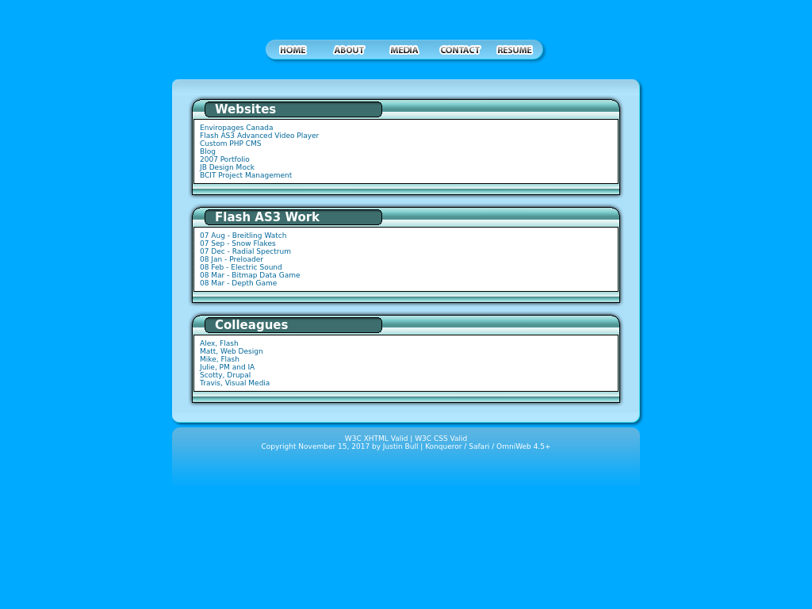

# Website 2007

An old backup of my personal website which hosted work done while attending BCIT.

### How To Use

```
git clone https://github.com/jabes/website-2007
cd website-2007
vagrant plugin install vagrant-hostsupdater
vagrant up
```

Now view in your browser: [http://website-2007.dev/](http://website-2007.dev/)

### CMS

A rudimentary content management system that allows you to manage clients and products.

[http://website-2007.dev/php/cms/](http://website-2007.dev/php/cms/)

The demo user is `admin@demo.com` and the password is `pass123`.

### phpMyAdmin

A tool to handle the administration of MySQL over the Web.

[http://website-2007.dev/phpmyadmin/](http://website-2007.dev/phpmyadmin/)

The localhost user is `root` and the password is `root`.

### Screenshots


